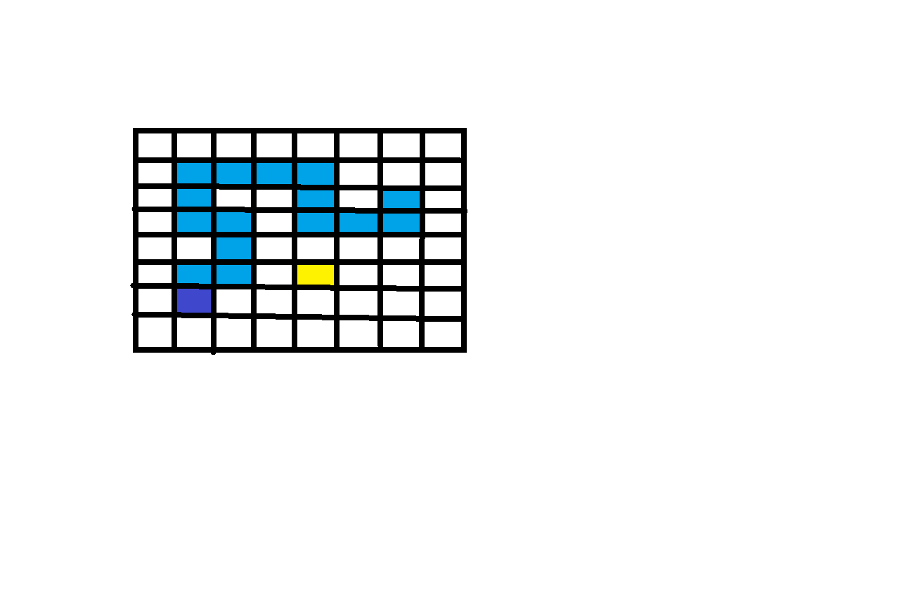
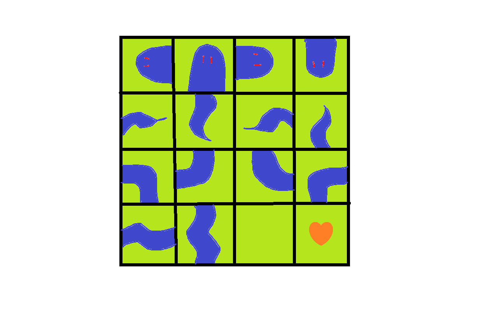

# 基于FPGA的贪吃蛇游戏
**一个具有VGA显示功能的贪吃蛇游戏。**

我和董佳昕研究思考了一下，大致把目前对这个工程的想法、想要实现的目标、以及可能的分工任务写了下来。大家有什么想法或者更好的理解可以一起谈一谈。
## 游戏Idea：
我把整个工程大致分为2个部分：
- 后端游戏逻辑
- 前端界面实现

1. 游戏逻辑（emm我预计2~3个人完成）： 设计一个RAM作为贪吃蛇的地图，每个地址映射地图的一块像素单元。RAM存储该像素单元的状态（类似于蛇的身体、食物、空地）。比如这张图的方格，就是一个8*8=64个地址的RAM，每个地址有4bit来存储，表示地图的该位置的状态。这张图里面紫色就对应蛇头，蓝色就对应蛇身体，黄色就代表食物。**总的来说游戏逻辑需要实现以下功能**：
    - 初始化逻辑：清除所有现有蛇的状态，在地图中央重新生成一条长为2的蛇
    - 移动逻辑：蛇身方向的改变、蛇的移动，以及蛇不同身体状态的记录
    - 吃食物逻辑：吃掉食物，蛇身体变长
    - 生成食物逻辑：每次食物被吃掉后，随机地在地图非蛇头、蛇身体的位置生成一个食物
    - 死亡逻辑：如果蛇头的移动接触到蛇的身体，那么蛇死亡，游戏结束
    - 计分逻辑：将蛇身体长度作为分数信号输出出来
2. 界面实现（预计1~2人）:  主要就是实现将游戏逻辑实时维护的RAM的数据转变成图像，并映射到VGA屏幕上。VGA驱动参考现有工程中[sourcecode/vga](./sourcecode/vga/VGA.v)下的文件。界面实现要调用游戏逻辑的RAM接口，将状态信号传输转换为图形信号，并映射到vga屏幕上。预计需要实现一个ROM（纹理文件），界面实现模块根据不同状态和vga的扫描周期，调用ROM，并从中采样得到图形的RGB值。ROM预计存储16种不同纹理，分别映射一个RAM地址下4bit的内容：蛇头4种、蛇尾4种、蛇身6种图形、空地1种、食物1种.(原谅我的画作的拙劣)**总的来说，界面实现需要完成：**
    - VGA图形驱动
    - 设计纹理：上图16种纹理，变成RGB值
    - ROM的实现：设计ROM，并存储纹理
    - 调用RAM接口并完成纹理映射：纹理映射就是用第二张图图的真正的蛇来代替第一张图的颜色块。

## 任务以及（目前的）分工以及其他：
**首先我有信心，如果这个工程实现了，我们的作业质量是会超过大多数同学的**，可以和老师协商增加更多分数，或者说适当减少我们的frext的对应比例（frext我是真顶不住，或者有大佬来带带我也可以呜呜呜）。这个项目基本上做出来其实就能赢下很多。

**但是这个项目也有一定的挑战性**，一周左右时间需要我们沟通合作完成。所以我在前期也做了一些工作，让这个工程的每个模块分的相对清晰一些，如果那里有觉得更好的idea欢迎补充。

**关于分工**:游戏逻辑有其特有的时钟周期，前端界面的时钟周期可以不与其同步，所以我觉得二者任务可以实现很大程度上的分离。这几天我一直再研究vga，如果coding过程顺利的话，前端大概我一个人就够了，大家也用不着再去学新的东西。游戏逻辑方面看看大家什么想法，可行性怎么样，怎么把功能模块分块（我觉得大体结构已经分的差不多了），具体想负责哪些。我们目前的工作是这些，未来如果有变故的话会相应进行更改。最后想说的是我们的成绩分配的话是按劳分配，尽力保证大家越多贡献的有更多分。

### 其他：
**游戏地图大小：** 我今天预估了一下，游戏地图 $20\times 20$的话，需要 $ 20\times 20\times 4 bit\approx 200 byte$ 。如果地图规模再大一点，加上其他的寄存器，整个游戏保守下来需要存1KB。不过后来问过学长，说kb量级的还是可以顶得住的。。。

**工程和代码规范**：尽量规范一点，
